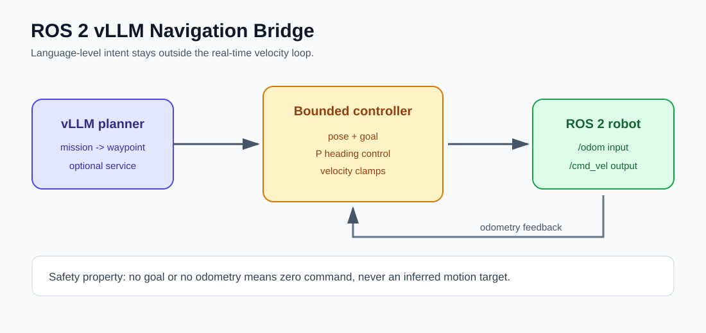
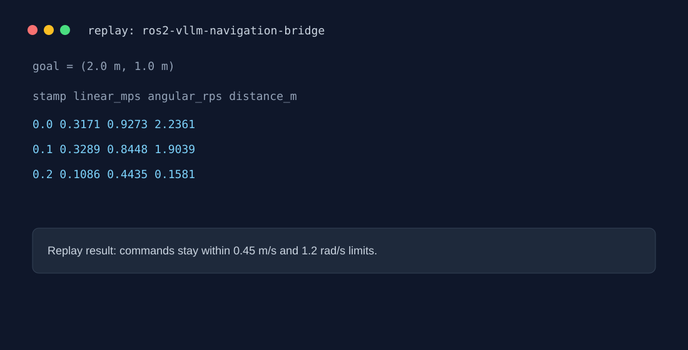

# ROS 2 vLLM Navigation Bridge





A robotics stack boundary between semantic planning and real-time motion control. A vLLM endpoint can translate a natural-language mission into a structured waypoint, while a deterministic local controller converts odometry and that waypoint into bounded `geometry_msgs/Twist`-compatible commands.

## Run with replay data

```powershell
$env:PYTHONPATH = "src"
python -m navigation_bridge.cli data\odom.jsonl --goal-x 2.0 --goal-y 1.0
```

The output is JSON Lines containing timestamp, linear velocity, angular velocity, and distance-to-goal. The fixture is replay input, not a claim about a physical robot.

## ROS 2 mode

With a ROS 2 Humble/Iron/Jazzy environment and `rclpy` installed:

```powershell
python -m navigation_bridge.ros_node
```

Topics:

- `/odom` (`nav_msgs/msg/Odometry`) input
- `/physical_ai/goal` (`geometry_msgs/msg/Point`) input
- `/cmd_vel` (`geometry_msgs/msg/Twist`) output

The vLLM adapter is intentionally outside the control loop. A model may propose a waypoint, but it cannot publish motor commands directly.

## NVIDIA / Isaac ROS paths

- `navigation_bridge.isaac_ros_contract` documents deployment-configurable camera, depth, odometry, and velocity topic boundaries used in an Isaac ROS graph.
- `navigation_bridge.obstacle_guard` adds a local projected-obstacle stop before `cmd_vel` is published.
- Isaac ROS NITROS acceleration belongs in the ROS 2 graph and container deployment; this repository keeps the Python replay path independent so it can be tested without Jetson hardware.
- A Jetson deployment can pair Isaac ROS stereo/depth perception with this controller, Triton/TensorRT perception services, and vLLM only for semantic mission decomposition.

Official reference: [NVIDIA Isaac ROS](https://nvidia-isaac-ros.github.io/).

## Safety and truthfulness

The controller clamps linear/angular velocity, stops inside the goal tolerance, and has no autonomous fallback goal. Missing odometry or an unavailable planner produces an explicit inactive state.
